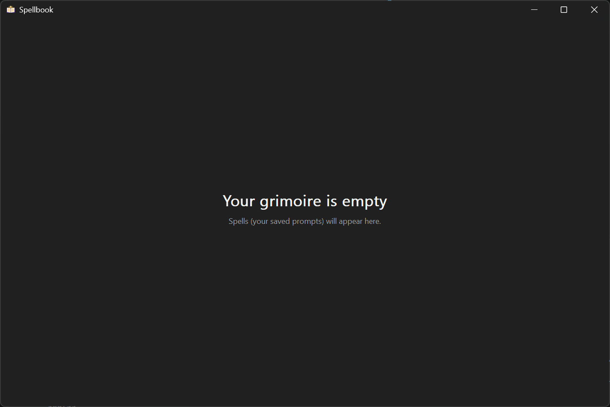
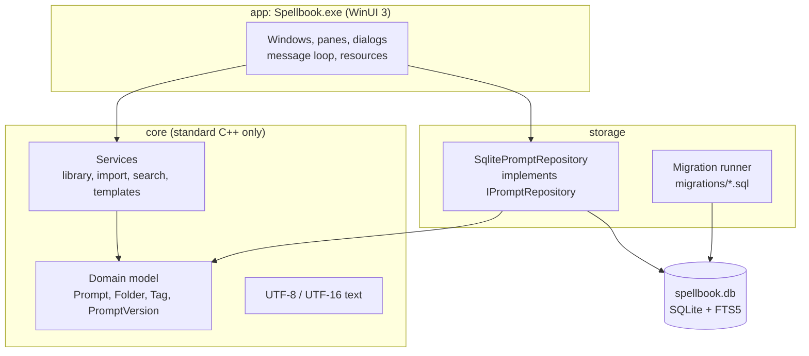

<div align="center">

<picture>
  <source media="(prefers-color-scheme: dark)" srcset="assets/banner-on-dark.svg">
  <source media="(prefers-color-scheme: light)" srcset="assets/banner-on-light.svg">
  
</picture>

<br>
<br>

<p>A fast, native Windows app to store, organise, search, template, and copy your AI prompts.<br>No account, no cloud, no browser tab. Just your spells, one keystroke away.</p>

[](https://github.com/rizonesoft/Spellbook/actions/workflows/ci.yml)
[](https://github.com/rizonesoft/Spellbook/releases)
[](LICENSE)
<br>
[](#quick-start)
[](docs/adr/0001-tech-stack.md)
[](docs/architecture.md)
[](docs/architecture.md#storage)

<br>



<sub><i>Spellbook today (M0): the window, the database, and the logging are in place; the library arrives in M1. A screen recording replaces this capture once there is something to show.</i></sub>

</div>

> [!NOTE]
> **Status: pre-alpha (M0, the skeleton).** Spellbook builds, opens its window, and creates its database, but you cannot store a prompt in it yet. The [roadmap](#roadmap) says what lands next. Star or watch the repository to hear about the first preview.

## Contents

- [Why Spellbook](#why-spellbook)
- [Features](#features)
- [Quick start](#quick-start)
- [Build from source](#build-from-source)
- [Usage](#usage)
- [Keyboard shortcuts](#keyboard-shortcuts)
- [Architecture](#architecture)
- [Roadmap](#roadmap)
- [Contributing](#contributing)
- [License](#license)

## Why Spellbook

If you work with AI models every day, your best prompts are worth keeping. Most of us keep them in a folder of Notepad files, a notes app, or a chat history we can never search. Spellbook is a home built for them.

- **Native Windows app.** A C++ WinUI 3 app with its runtime bundled in one application folder.
- **Find anything in two seconds.** Full-text search across every prompt, and a global hotkey that summons a quick-search popup over any app.
- **Templates that fill themselves in.** Write `{{topic}}` once; Spellbook asks for it when you copy.
- **Bring your scrolls.** Import a whole folder of `.txt` prompt files in one go, with a preview, encoding detection, and duplicates skipped.
- **Yours, on your machine.** One SQLite file in `%LOCALAPPDATA%\Spellbook`. No account, no sync, no telemetry, no network calls.
- **A little magic, never confusing.** Prompts are Spells, folders are Chapters, copying is Cast. Every themed word has a tooltip with its plain meaning, and a setting turns the theme off.

## Features

Legend: ✅ works today · 🚧 in progress · 📋 planned

| Area | Status | Milestone | Notes |
| ---- | :----: | :-------: | ----- |
| Native window, DPI-aware, dark title bar | ✅ | M0 | Per-Monitor-V2, Common Controls v6 |
| Local database with full-text search index | ✅ | M0 | SQLite with FTS5, versioned migrations |
| Spells and Chapters (prompts and folders) | 📋 | M1 | Create, edit, rename, move, delete |
| Editor with autosave | 📋 | M1 | Saved a second after you stop typing |
| Import scrolls (`.txt` files) | 📋 | M2 | Preview, encoding detection, duplicates skipped, undo |
| Instant search | 📋 | M3 | Ranked full-text search with snippets |
| Sigils (tags) and favourites | 📋 | M3 | Filter by tag; sort by recent or most used |
| Cast to the clipboard | 📋 | M3 | Ctrl+Enter copies, and counts the use |
| Quick-search popup | 📋 | M3 | A global hotkey over any app |
| Runes (`{{name}}` templates) | 📋 | M4 | Fill-in dialog with defaults and a live preview |
| Revisions and compare | 📋 | M4 | Every edit kept; side-by-side diff; restore |
| Full dark mode, settings, export, backup | 📋 | M5 | JSON and Markdown export, restore from backup |
| Installer | 📋 | M5 | Inno Setup, per-user by default |

## Quick start

> [!IMPORTANT]
> There is no release yet. Until v0.1.0, run Spellbook by building it from source (below).

Once released, Spellbook ships two ways from the [releases page](https://github.com/rizonesoft/Spellbook/releases):

| Form | Best for |
| ---- | -------- |
| **Installer** (`Spellbook-<version>-win-x64-Setup.exe`) | Most people: Start menu entry, optional start with Windows for the hotkey, clean uninstall |
| **Portable ZIP** (`Spellbook-<version>-win-x64-portable.zip`) | Trying it out, or locked-down machines: unzip and run |

Check the download against the `SHA256SUMS` file on the release. Requirements: Windows 10 22H2 or Windows 11, 64-bit. Keep the complete extracted folder together: it includes the runtime DLLs and resources beside `Spellbook.exe`, so no separate Windows App Runtime installation is required.

## Build from source

<details open>
<summary><strong>Prerequisites</strong></summary>

- Windows 10 22H2 or Windows 11, x64
- [Visual Studio 2026](https://visualstudio.microsoft.com/) with **Desktop development with C++** (MSVC v145 and a Windows SDK) and the **C++ WinUI app tools** (`Microsoft.VisualStudio.Component.WindowsAppSdkSupport.Cpp`). Setup prints the VS Installer repair command; machine-wide installation remains an operator step.
- [PowerShell 7](https://learn.microsoft.com/powershell/scripting/install/installing-powershell-on-windows), [Git](https://git-scm.com/), and [Python 3](https://www.python.org/) (for the plan and docs checks)

Everything else (CMake, Ninja, vcpkg, clang-format, clang-tidy, actionlint) is pinned in [`toolchain.json`](toolchain.json) and downloaded into the repository's `.tools/` folder by the setup script. Nothing is installed globally.

</details>

```powershell
git clone https://github.com/rizonesoft/Spellbook.git
cd Spellbook

pwsh scripts/setup.ps1        # provision the pinned toolchain into .tools/ (first run: a few minutes)
pwsh scripts/build.ps1        # configure and build Debug (first build compiles the vcpkg dependencies)
pwsh scripts/test.ps1         # build and run the unit tests
pwsh scripts/run.ps1          # build if needed and launch Spellbook.exe
```

Every script takes `-Help`. The others:

| Script | Does |
| ------ | ---- |
| `scripts/check-all.ps1` | Every gate CI runs: toolchain, layering, format, Debug and Release builds, tests, launch smoke, lint, docs, plan |
| `scripts/format.ps1` | clang-format every source (`-Check` to verify only) |
| `scripts/lint.ps1` | Library clang-tidy, MSVC app analysis, and the layering check |
| `scripts/migrate.ps1` | Apply the migrations to a dev database in `build/dev-data/` and show the schema |
| `scripts/package.ps1` | Build Release and produce the portable ZIP and `SHA256SUMS` |
| `scripts/release.ps1` | Move the changelog, commit, and tag `v<version>` |

Details and troubleshooting: [docs/dev/build.md](docs/dev/build.md).

## Usage

Spellbook keeps everything in `%LOCALAPPDATA%\Spellbook\`: the database `spellbook.db` and the log `logs\spellbook.log`. Today, launching it creates the database and shows an empty grimoire. The user guide grows with each milestone: [docs/user/](docs/user/README.md).

A quick glossary, since the interface uses a light magic flavour:

| You see | It means |
| ------- | -------- |
| Spell | A saved prompt |
| Chapter | A folder of prompts |
| Sigil | A tag |
| Cast (Ctrl+Enter) | Copy the prompt to the clipboard, with its variables filled in |
| Rune (`{{name}}`) | A template variable |
| Revisions | Version history |
| Import scrolls | Import `.txt` files |

## Keyboard shortcuts

Planned for v0.1.0; each lands with its milestone and is listed here when it works.

| Shortcut | Action | Milestone |
| -------- | ------ | :-------: |
| Ctrl+N | New spell | M1 |
| Ctrl+Shift+N | New chapter | M1 |
| F2 | Rename | M1 |
| Del | Delete (with confirmation) | M1 |
| Ctrl+M | Move to chapter | M1 |
| Ctrl+F or Ctrl+K | Search | M3 |
| Ctrl+Enter | Cast (copy, filling in runes) | M3, M4 |
| Ctrl+Shift+Enter | Cast the raw template | M4 |
| Ctrl+D | Toggle favourite | M3 |
| Win+Shift+Space | Quick-search popup from anywhere | M3 |
| F6, Tab | Move between panes | M1 |

## Architecture

Three layers, each depending only on the ones below it. Logic lives in **core**, which is plain C++ with no Windows headers, so it is unit-tested without a window.



<details>
<summary><strong>Technology stack</strong></summary>

| Piece | Choice |
| ----- | ------ |
| Language | C++20, MSVC (Visual Studio 2026 v145 toolset), `/W4 /WX` |
| UI | WinUI 3 with C++/WinRT, Per-Monitor-V2 DPI, Unicode, and native interop |
| Storage | SQLite with FTS5, behind `IPromptRepository` |
| Libraries | spdlog and fmt (logging), nlohmann-json (settings and export), Catch2 (tests) |
| Build | CMake/Ninja libraries and tests, MSBuild WinUI app, pinned NuGet packages, and static vcpkg libraries |
| Packaging | Portable ZIP now; Inno Setup 7 installer in M5 |

The reasoning is in [ADR 0001](docs/adr/0001-tech-stack.md) and [docs/architecture.md](docs/architecture.md).

</details>

<details>
<summary><strong>Repository layout</strong></summary>

| Path | What it holds |
| ---- | ------------- |
| `src/core/` | Domain model and services |
| `src/storage/` | The repository interface and its SQLite implementation |
| `src/app/` | The WinUI app: XAML, C++/WinRT windows, resources, and the MSBuild project |
| `migrations/` | Versioned schema steps |
| `tests/` | Unit tests for core and storage |
| `scripts/` | PowerShell runners and the Python checks |
| `todo/` | The development plan |
| `docs/` | Architecture, decisions, and guides |
| `standards/` | Coding, UI, testing, and release standards |

</details>

## Roadmap

The plan lives in the repository: [todo/implementation-plan.md](todo/implementation-plan.md) is the ordered list of every section, with its progress derived from the TODO files.

1. **M0 Skeleton:** the window opens, the database is created and migrated, logging works, CI is green. *(this release of the plan)*
2. **M1 Library:** the list and editor panes, create, edit, and delete, chapters, autosave.
3. **M2 Import scrolls:** bring a folder of `.txt` prompts across with a preview, encoding detection, duplicate skipping, and undo.
4. **M3 Find and cast:** instant search, sigils, favourites, copy to the clipboard, the global quick-search popup, sorting by recent and most used.
5. **M4 Runes and revisions:** `{{variable}}` templates with a fill-in dialog, version history, and diff.
6. **M5 Polish and ship:** dark mode throughout, export and backup, settings, the installer, and v0.1.0.

## Contributing

Contributions are welcome, from bug reports to pull requests.

- Read [CONTRIBUTING.md](CONTRIBUTING.md) for the workflow, the plan, and the commit style.
- Report bugs and request features through [Issues](https://github.com/rizonesoft/Spellbook/issues/new/choose).
- Report security problems privately, as described in [SECURITY.md](SECURITY.md).
- Everyone taking part follows the [Code of Conduct](CODE_OF_CONDUCT.md).

More documentation: [docs/](docs/README.md) · [user guide](docs/user/README.md) · [build guide](docs/dev/build.md).

## License

Copyright (c) 2026 Rizonetech (Pty) Ltd. Rizonesoft is a brand of Rizonetech (Pty) Ltd.

Spellbook is released under the [MIT License](LICENSE).

Built with [SQLite](https://sqlite.org/), [spdlog](https://github.com/gabime/spdlog), [{fmt}](https://fmt.dev/), [nlohmann/json](https://github.com/nlohmann/json), and [Catch2](https://github.com/catchorg/Catch2), through [vcpkg](https://vcpkg.io/).

<div align="center">
<sub>Made in the open by <a href="https://www.rizonesoft.com/?utm_source=github&utm_medium=readme-footer">Rizonesoft</a>.</sub>
</div>
