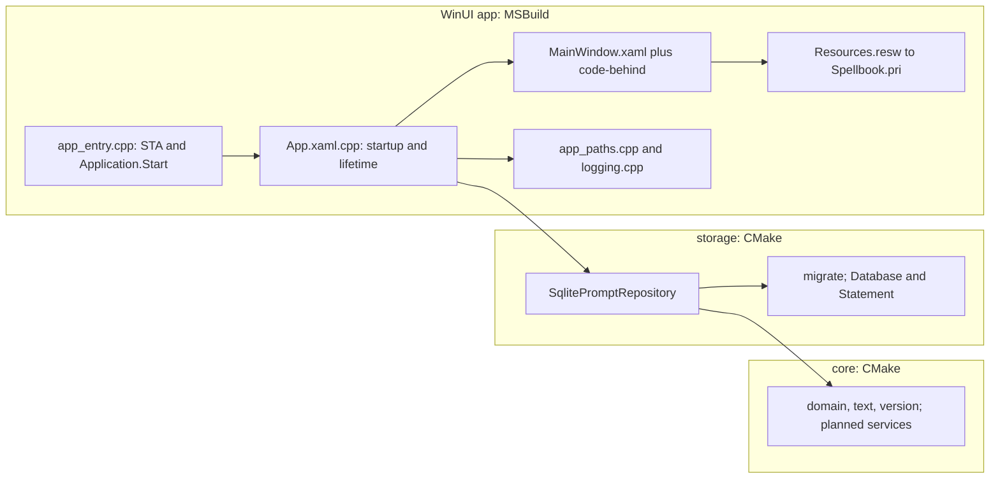

# Architecture

Spellbook separates tested C++ services and SQLite storage from its WinUI 3 presentation. [ADR 0002](adr/0002-winui-3.md) supersedes the original UI/build/deployment choices in [ADR 0001](adr/0001-tech-stack.md); other decisions remain in force. [AGENTS.md](../AGENTS.md), the independent `CLAUDE.md`, and the [standards](../standards/README.md) govern changes.

## Layers

```
core  <-  storage  <-  app
```

| Layer | Build target | Responsibility and boundary |
| ----- | ------------ | --------------------------- |
| core | CMake `spellbook_core` static library | Standard C++ domain types, text encoding, version information; planned services hold library, search, import, template, and other domain decisions. No Windows, WinRT, storage, or app headers. Interfaces needed by core move here in D01 T01 §3. |
| storage | CMake `spellbook_storage` static library | `IPromptRepository`, `SqlitePromptRepository`, SQLite RAII, and migrations. Depends on core and SQLite, with current logging support; no Windows/WinRT/app headers. |
| app | MSBuild `Spellbook.vcxproj` in `Spellbook.slnx` | Entry point, WinUI application/window, XAML, resource lookup, presentation adapters, and documented native interoperability. Depends on the lower libraries and WinUI 3/C++/WinRT. |

Domain decisions stay below app, where tests exercise them without a window. A view model may adapt data into observable display/selection state; it cannot become a second domain service or issue SQL. Event handlers call services, marshal results back to the UI thread, and present errors with context. `scripts/check-layering.py` enforces header boundaries, including generated WinUI header families, and checks every owned app source is unconditionally included by the MSBuild project.



The current shell shows the empty library. M1 adds service-backed panes and presentation models; those are planned responsibilities, not already implemented bindings.

## Startup and lifetime

1. `wWinMain` in `src/app/app_entry.cpp` validates `--data-dir` and `--smoke`. Smoke requires an explicit isolated data directory, including for invalid-command probes.
2. It initializes the WinRT single-threaded apartment and calls `Microsoft::UI::Xaml::Application::Start`; WinUI owns the UI message loop.
3. `App::OnLaunched` resolves/creates the chosen data directory, starts rotating logging, opens `SqlitePromptRepository`, and applies pending migrations. The bootstrap performs this initial open synchronously; long feature operations must use the documented background-service/UI-dispatch pattern.
4. App constructs the MainWindow implementation with `winrt::make_self`, initializes it, retains a projected `Window` reference, and activates it. MainWindow uses XAML layout and resources, sets Mica and a custom title bar, and configures the icon and window bounds.
5. Smoke waits for a rendered frame, revokes its rendering subscription, queues a low-priority close through `DispatcherQueue.TryEnqueue`, and logs the painted/closing event. Weak references protect callbacks against an expired window.
6. Startup/WinUI unhandled errors set a failing exit code, log, and close. `show_startup_error` supplies an action-prefixed native message box when not in smoke mode, including failures before XAML/resources initialize. Smoke never displays a blocking dialog. The entry point shuts logging down after the application loop exits.

App holds the repository and window for their required lifetimes. Runtime objects are reference-counted through C++/WinRT factories/references. Future async actions must independently handle cancellation and window closure, revoke subscriptions to longer-lived publishers, and deliver UI changes only on the owning thread. A surviving object reference does not guarantee an open window. Database access belongs to a serialized service owner; background tasks do not arbitrarily share the UI's connection.

## Storage

- **One SQLite file**, `spellbook.db`, opened with foreign keys on, `journal_mode = WAL` (a crash mid-write keeps the last committed state; readers never block the writer), `synchronous = NORMAL`, and a 5 second busy timeout.
- **Schema 1** (`migrations/0001_init.sql`): `folders` (hierarchical through `parent_id`, sibling names unique ignoring case), `prompts`, `tags`, `prompt_tags`, `prompt_versions`, and `prompts_fts`.
- **Full-text search**: `prompts_fts` is an external-content FTS5 table over `prompts(title, body, description)` with the `unicode61 remove_diacritics 2` tokenizer, kept in step by insert, update, and delete triggers. Search ranks with `bm25()` and builds user queries through a safe query builder (`D03 T01 §1`).
- **Times** are INTEGER milliseconds since the Unix epoch, UTC. **Text** is UTF-8. **Booleans** are 0 or 1 with a CHECK.

### Migrations

- `migrations/NNNN_name.sql`, numbered from 0001 with no gaps.
- `cmake/EmbedMigrations.cmake` turns them into byte arrays in a generated source at build time, so deployment needs no separate migration SQL files. The build fails on a bad name or a gap.
- `storage::migrate()` reads `PRAGMA user_version`, refuses a database newer than the build, and applies each newer step in its own `BEGIN IMMEDIATE` transaction together with the `user_version` bump: a failure leaves the database at the last complete version.
- A shipped migration is never edited. Follow the selected writer's independent `add-migration` skill for a new one.

### The repository interface

`IPromptRepository` is the seam between the program and its storage. M0 exposes `schema_version()` and `prompt_count()`; each milestone adds what it needs (prompt and folder CRUD in M1, import batches in M2, search, tags, and use tracking in M3, revisions in M4). The app and the core services see only the interface, so a second implementation (the MySQL alternative in ADR 0001, backlog `B-001`) would not change anything above storage.

## Presentation and resources

- **XAML and binding:** paired XAML/code-behind/IDL declare the UI and its projected API. Compiled `{x:Bind}` properties require explicit update modes and notifications for changing values. Pure domain types stay ordinary C++ below app; presentation adapters expose only display state and service actions.
- **Copy:** `src/app/Strings/en-US/Resources.resw` supplies current title/empty-state text through `x:Uid` and MRT Core `ResourceLoader`. The themed/plain vocabulary adapter and persisted selection arrive in D01 T01 §4 and D05 T01 §2. All normal labels belong to app resources, not core. The startup fallback intentionally works without the PRI.
- **Threading:** use the WinUI `Microsoft::UI::Dispatching::DispatcherQueue` with checked `TryEnqueue`, or await an `apartment_context` captured on the UI thread. The current generated `resume_foreground` overload takes `Windows::System::DispatcherQueue`, a distinct type; see the pattern skills for the recorded compatibility exception. Domain work stays cancellable and does not block interaction.
- **Theme:** XAML uses WinUI theme resources; Mica and the custom title bar are initialized in MainWindow. Full theme/vocabulary settings remain planned. Preserve contrast-theme behavior and an opaque fallback when a backdrop is unavailable.
- **DPI:** XAML uses automatically scaled DIPs. Native `AppWindow` geometry uses physical pixels; the shell scales the 960 by 640 initial and 480 by 320 minimum DIP sizes at that boundary and refreshes limits from `XamlRoot.Changed`.
- **Interop:** native W APIs remain for command-line parsing, paths, startup errors, and window-DPI lookup. Global hotkey/tray work is a later explicit native boundary. The manifest declares Per-Monitor-V2, the UTF-8 process code page, long-path awareness, segment heap, and Windows compatibility. WinRT/native resources never leak into core or storage.

Implementation recipes are independently maintained in the [Codex WinUI skill](../.agents/skills/winui-patterns/SKILL.md) and [Claude WinUI skill](../.claude/skills/winui-patterns/SKILL.md). Shared interaction policy is in [the UI standard](../standards/ui.md).

## Build and source ownership

`build.ps1` enters the pinned-compatible VS 2026 x64 environment, configures/builds CMake's libraries and Catch2 tests with Ninja, then restores/builds `Spellbook.slnx` with MSBuild. CMake produces migration/version data and NuGet pin properties; the app links the resulting libraries. NuGet uses the exact Windows App SDK and C++/WinRT versions in `toolchain.json`, while vcpkg supplies the C++ library dependencies with the `x64-windows-static` triplet.

`Spellbook.vcxproj` declares XAML, IDL, resource, and owned source inputs. Generated projection files stay below `artifacts/build/<preset>/app-obj/`; full deployment output is `artifacts/build/<preset>/app/`. `Spellbook.props` applies `/W4 /WX`, C++20, and the configuration's static CRT to owned app code. Its forced `pch.h` include supplies COM declarations before projections without using a compiled PCH. Library warnings are enforced through `cmake/SpellbookWarnings.cmake`. Library static analysis uses pinned clang-tidy; owned app analysis uses MSVC `/analyze` with external-header analysis excluded.

`cmake/SpellbookVersion.cmake` derives the version from git tags and produces build information and the version resource. Repo-portable tools are pinned in `toolchain.json` and live in `.tools/`; see [the build guide](dev/build.md). Machine-wide Visual Studio and Windows SDK installation remains operator-owned; only disposable hosted CI uses the guarded component provisioner.

## Data on disk

| Path | What |
| ---- | ---- |
| `%LOCALAPPDATA%\Spellbook\spellbook.db` (`-wal`, `-shm`) | The library |
| `%LOCALAPPDATA%\Spellbook\logs\spellbook.log` | Rotating logs: actions and IDs, never prompt text |
| `%LOCALAPPDATA%\Spellbook\settings.json` | Planned M5 settings |

Tests and driven runs use explicit isolated data directories. The portable data marker behavior is owned by the later distribution plan; the current ZIP is the self-contained program payload and still uses the default user data directory unless `--data-dir` is supplied.

## Packaging and proof

`scripts/package.ps1` packages the complete Release app folder, excluding developer-only symbols/libraries, with Spellbook's license/README, the resolved Windows App SDK/C++/WinRT terms, and vcpkg dependency notices. The archive and SHA256SUMS are prepared before publication; ordinary write failures preserve or restore the previous pair, and a failed rollback retains a named recovery directory. Two-file publication is not power-loss atomic.

`scripts/test-package.ps1` verifies the hash, extracts to an isolated directory, launches with isolated data, and reads back the database. Hosted CI additionally runs the extracted archive outside the checkout after removing registered runtime packages only from its disposable runner user. This proves app-local deployment; a lone `Spellbook.exe` is not the deliverable. The Inno Setup 7 folder installer remains D05 T02 §2; no release/tag is created by plan processing.
