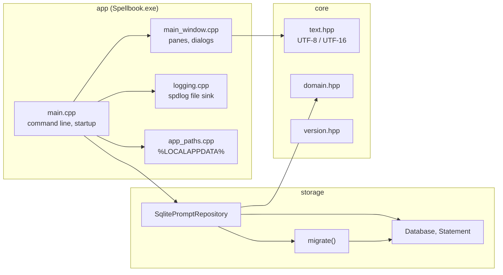

# Architecture

How Spellbook is put together, and why. The decisions are recorded in [ADR 0001](adr/0001-tech-stack.md); the rules every change follows are in [`../AGENTS.md`](../AGENTS.md) and [`../standards/`](../standards/README.md).

## Layers

```
core  <-  storage  <-  app
```

| Layer | Target | Holds | May include |
| ----- | ------ | ----- | ----------- |
| core | `spellbook_core` (static library) | The domain model (`Prompt`, `Folder`, `Tag`, `PromptVersion`, `TemplateVariable`), text encoding, version info; from M1 the services (library, import planning, search queries, templates, diff, settings, export) and the interfaces they need (`IPromptRepository` and `IClock` move here in `D01 T01 §3`) | the standard library; header-only nlohmann-json from M5 |
| storage | `spellbook_storage` (static library) | `IPromptRepository`, `SqlitePromptRepository`, the RAII SQLite wrapper (`Database`, `Statement`, `StorageError`), the migration runner, and the embedded migrations | core, SQLite, spdlog |
| app | `Spellbook.exe` (WIN32) | `wWinMain`, the main window and panes, dialogs, the clipboard, the hotkey, resources, and the manifest | core, storage, Win32, spdlog |

The rule that makes this work: **logic belongs in core.** A window procedure translates messages into calls on a core service and renders what comes back. Anything a test would want to check lives below the app, where `tests/core/` and `tests/storage/` reach it without a window. `scripts/check-layering.py` fails a core or storage source that includes a Windows header, and a core source that includes a storage or app header.



## Startup

`wWinMain` (`src/app/main.cpp`):

1. Parses the command line (`--data-dir <path>`, `--smoke`).
2. Initialises Common Controls v6.
3. Resolves the data folder (`%LOCALAPPDATA%\Spellbook` through `SHGetKnownFolderPath`, or `--data-dir`) and creates it.
4. Starts logging to `<data>\logs\spellbook.log` (rotating, 5 files of 5 MB).
5. Opens `<data>\spellbook.db` through `SqlitePromptRepository::open`, which sets the connection pragmas and applies every pending migration. A failure here is shown in a message box (or, under `--smoke`, only logged) and the app exits 1.
6. Creates the main window, then runs the message loop. Under `--smoke` it posts `WM_CLOSE` after the first paint and exits 0.

## Storage

- **One SQLite file**, `spellbook.db`, opened with foreign keys on, `journal_mode = WAL` (a crash mid-write keeps the last committed state; readers never block the writer), `synchronous = NORMAL`, and a 5 second busy timeout.
- **Schema 1** (`migrations/0001_init.sql`): `folders` (hierarchical through `parent_id`, sibling names unique ignoring case), `prompts`, `tags`, `prompt_tags`, `prompt_versions`, and `prompts_fts`.
- **Full-text search**: `prompts_fts` is an external-content FTS5 table over `prompts(title, body, description)` with the `unicode61 remove_diacritics 2` tokenizer, kept in step by insert, update, and delete triggers. Search ranks with `bm25()` and builds user queries through a safe query builder (`D03 T01 §1`).
- **Times** are INTEGER milliseconds since the Unix epoch, UTC. **Text** is UTF-8. **Booleans** are 0 or 1 with a CHECK.

### Migrations

- `migrations/NNNN_name.sql`, numbered from 0001 with no gaps.
- `cmake/EmbedMigrations.cmake` turns them into byte arrays in a generated source at build time, so the app needs no files beside it. The build fails on a bad name or a gap.
- `storage::migrate()` reads `PRAGMA user_version`, refuses a database newer than the build, and applies each newer step in its own `BEGIN IMMEDIATE` transaction together with the `user_version` bump: a failure leaves the database at the last complete version.
- A shipped migration is never edited. The procedure for a new one is `.claude/skills/add-migration/SKILL.md`.

### The repository interface

`IPromptRepository` is the seam between the program and its storage. M0 exposes `schema_version()` and `prompt_count()`; each milestone adds what it needs (prompt and folder CRUD in M1, import batches in M2, search, tags, and use tracking in M3, revisions in M4). The app and the core services see only the interface, so a second implementation (the MySQL alternative in ADR 0001, backlog `B-001`) would not change anything above storage.

## The Win32 shell

- **Unicode**: `UNICODE` and `_UNICODE` for every target, W APIs only, UTF-8 inside the program and UTF-16 at the API boundary (`core::utf8_to_wide`, `core::wide_to_utf8`).
- **Manifest** (`src/app/res/spellbook.manifest`, embedded through `spellbook.rc`): Common Controls v6, Per-Monitor-V2 DPI awareness, the UTF-8 active code page (so even a narrow API copes with a non-ASCII profile path), long path awareness, the segment heap, Windows 10 and 11 compatibility.
- **DPI**: sizes are written in DIPs and scaled with the window's DPI; fonts and icons are rebuilt on `WM_DPICHANGED`.
- **Theme**: the title bar follows the Windows app mode now; every control follows it from `D05 T01 §1`.
- **Ownership**: each window owns its C++ object through `GWLP_USERDATA` and deletes it in `WM_NCDESTROY`. The patterns are in `.claude/skills/win32-ui-patterns/SKILL.md`.

## Build

- CMake presets (`CMakePresets.json`) over Ninja and MSVC, with the vcpkg toolchain in manifest mode (`vcpkg.json`) and the `x64-windows-static` triplet. The static CRT (`CMAKE_MSVC_RUNTIME_LIBRARY`) makes `Spellbook.exe` self-contained.
- `cmake/SpellbookWarnings.cmake` applies `/W4 /WX /permissive- /utf-8` per target and fails the configure for a target that missed it.
- `cmake/SpellbookVersion.cmake` derives the version from the latest `v*` tag; `build_info.hpp` and the `VERSIONINFO` resource are generated from it.
- The toolchain is pinned in `toolchain.json` and provisioned into `.tools/` by `scripts/setup.ps1`; details in [`dev/build.md`](dev/build.md).

## Data on disk

| Path | What |
| ---- | ---- |
| `%LOCALAPPDATA%\Spellbook\spellbook.db` (`-wal`, `-shm`) | The library |
| `%LOCALAPPDATA%\Spellbook\logs\spellbook.log` | The rotating log (actions and ids, never prompt text) |
| `%LOCALAPPDATA%\Spellbook\settings.json` | Settings (from M5) |

## Packaging

The portable ZIP (`scripts/package.ps1`) holds the one exe, the license, and the README. The Inno Setup 7 installer arrives in M5 (`D05 T02 §2`); ADR 0001 explains the choice.
